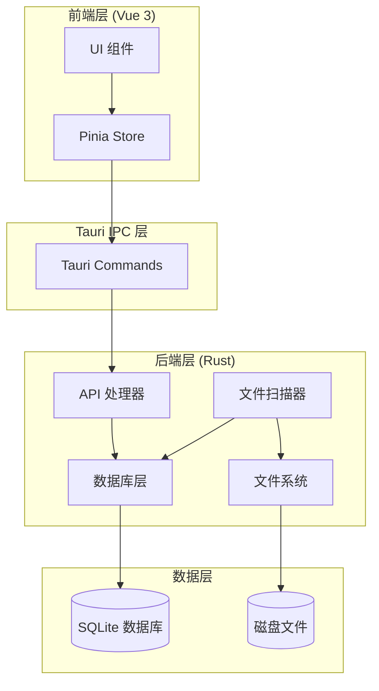
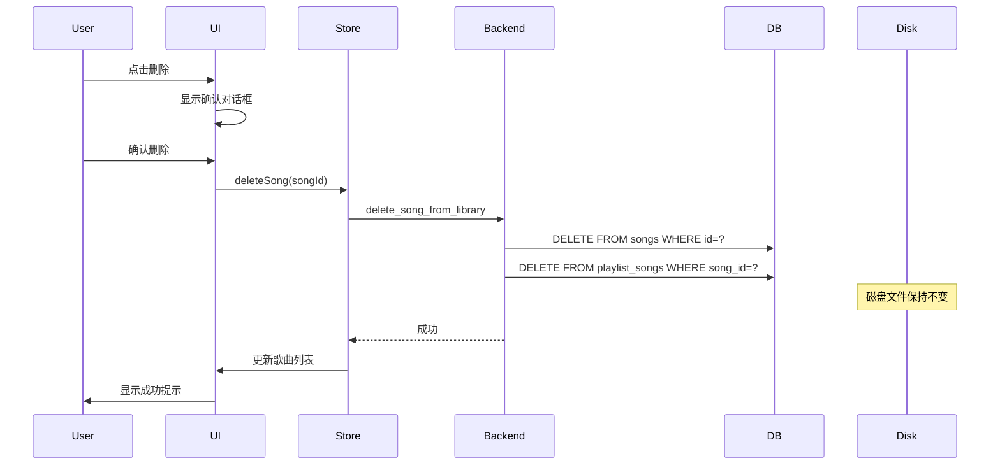
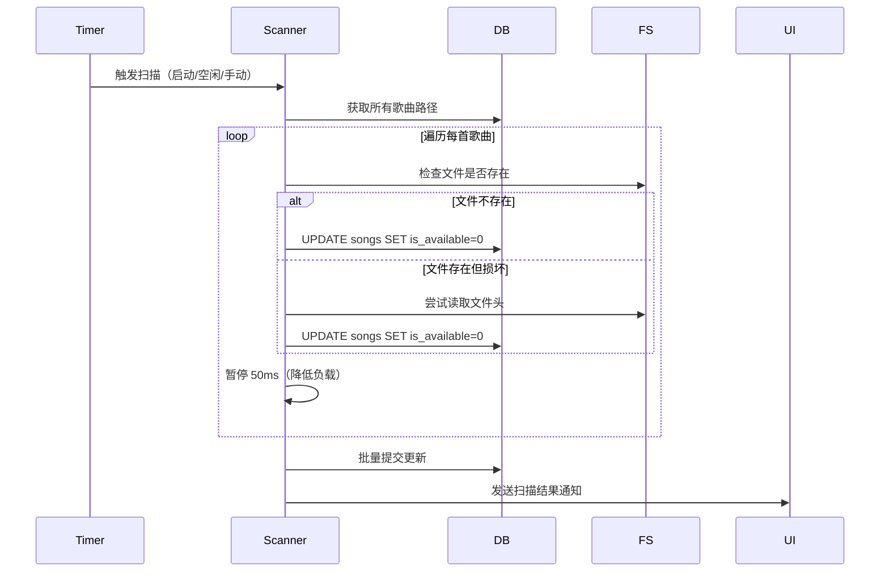

# 设计文档

## 概述

音乐库管理功能为音乐播放器提供完整的音乐库和歌单管理能力。本设计实现了非破坏性删除机制（仅删除数据库记录，保留磁盘文件）、文件有效性检测、无效歌曲标识和清理，以及播放来源显示。

### 核心设计原则

1. **数据安全优先**：删除操作仅影响数据库记录，永不删除磁盘文件
2. **异步处理**：文件扫描在后台线程执行，不阻塞 UI
3. **渐进式增强**：核心功能优先，扫描和清理功能作为增强
4. **清晰的视觉反馈**：使用不同的视觉标识区分歌曲状态

### 技术栈

- **前端**：Vue 3 + TypeScript + Pinia
- **后端**：Rust + Tauri + SQLite
- **音频**：Howler.js
- **UI**：原生 CSS（与现有风格保持一致）

## 架构

### 系统架构图



### 数据流

#### 删除歌曲流程


#### 文件扫描流程


## 组件和接口

### 前端组件

#### 1. LibraryView.vue（音乐库视图）

**职责**：
- 显示音乐库中的所有歌曲
- 提供删除、扫描、清理功能
- 标识无效歌曲

**新增状态**：
```typescript
interface LibraryViewState {
  songs: Song[]
  scanning: boolean
  scanProgress: { current: number; total: number } | null
  invalidSongCount: number
  selectedSongIds: Set<number>
}
```

**新增方法**：
```typescript
// 删除歌曲（仅删除数据库记录）
async deleteSongs(songIds: number[]): Promise<void>

// 手动触发文件扫描
async scanFiles(): Promise<void>

// 取消正在进行的扫描
async cancelScan(): Promise<void>

// 清理无效歌曲
async cleanupInvalidSongs(): Promise<void>
```

#### 2. PlaylistView.vue（歌单视图）

**职责**：
- 显示歌单中的歌曲
- 标识已删除和无效的歌曲
- 提供清理无效歌曲功能

**新增状态**：
```typescript
interface PlaylistViewState {
  songs: Song[]
  deletedSongIds: Set<number>  // 已从音乐库删除的歌曲
  invalidSongIds: Set<number>  // 文件不存在的歌曲
}
```

**新增方法**：
```typescript
// 清理歌单中的无效歌曲
async cleanupInvalidSongs(): Promise<void>
```

#### 3. PlayerBar.vue（播放器栏）

**职责**：
- 显示当前播放的歌曲信息
- 显示播放来源
- 自动跳过无效歌曲

**新增状态**：
```typescript
interface PlayerBarState {
  playbackSource: {
    type: 'library' | 'playlist' | 'recent'
    name?: string  // 歌单名称（如果来源是歌单）
  } | null
}
```

**新增方法**：
```typescript
// 跳过无效歌曲并播放下一首
async skipInvalidAndPlayNext(): Promise<void>
```

#### 4. FileScanner（文件扫描服务）

**职责**：
- 后台扫描文件有效性
- 管理扫描任务的生命周期
- 提供扫描进度反馈

**接口**：
```typescript
interface FileScannerService {
  // 开始扫描
  startScan(): Promise<void>
  
  // 取消扫描
  cancelScan(): void
  
  // 获取扫描进度
  getProgress(): { current: number; total: number } | null
  
  // 监听扫描完成事件
  onScanComplete(callback: (result: ScanResult) => void): void
}

interface ScanResult {
  totalScanned: number
  invalidCount: number
  duration: number
}
```

### 后端 API

#### 1. 歌曲管理 API

```rust
// 从音乐库删除歌曲（仅删除数据库记录）
#[tauri::command]
async fn delete_song_from_library(
    state: State<'_, AppState>,
    song_id: i64
) -> Result<(), String>

// 批量删除歌曲
#[tauri::command]
async fn delete_songs_from_library(
    state: State<'_, AppState>,
    song_ids: Vec<i64>
) -> Result<(), String>

// 清理所有无效歌曲
#[tauri::command]
async fn cleanup_invalid_songs(
    state: State<'_, AppState>
) -> Result<usize, String>

// 获取无效歌曲数量
#[tauri::command]
async fn get_invalid_song_count(
    state: State<'_, AppState>
) -> Result<usize, String>
```

#### 2. 文件扫描 API

```rust
// 开始文件有效性扫描
#[tauri::command]
async fn start_file_scan(
    state: State<'_, AppState>,
    app_handle: AppHandle
) -> Result<(), String>

// 取消文件扫描
#[tauri::command]
async fn cancel_file_scan(
    state: State<'_, AppState>
) -> Result<(), String>

// 获取扫描进度
#[tauri::command]
async fn get_scan_progress(
    state: State<'_, AppState>
) -> Result<Option<ScanProgress>, String>

#[derive(Serialize)]
struct ScanProgress {
    current: usize,
    total: usize,
    percentage: f32,
}
```

#### 3. 歌单管理 API

```rust
// 清理歌单中的无效歌曲
#[tauri::command]
async fn cleanup_playlist_invalid_songs(
    state: State<'_, AppState>,
    playlist_id: i64
) -> Result<usize, String>

// 获取歌单中的无效歌曲数量
#[tauri::command]
async fn get_playlist_invalid_count(
    state: State<'_, AppState>,
    playlist_id: i64
) -> Result<usize, String>
```

### 数据模型

#### 扩展 Song 模型

现有的 `Song` 模型已包含 `is_available` 字段，无需修改：

```rust
pub struct Song {
    pub id: i64,
    pub path: String,
    pub title: String,
    pub artist: String,
    pub album: String,
    pub album_artist: String,
    pub year: Option<i32>,
    pub genre: String,
    pub duration: i64,
    pub cover_art: Option<Vec<u8>>,
    pub bitrate: Option<i32>,
    pub sample_rate: Option<i32>,
    pub is_available: bool,  // 文件是否可用
    pub updated_at: i64,
}
```

#### 新增扫描状态模型

```rust
#[derive(Debug, Clone, Serialize, Deserialize)]
pub struct ScanState {
    pub is_scanning: bool,
    pub current: usize,
    pub total: usize,
    pub started_at: Option<i64>,
}

impl Default for ScanState {
    fn default() -> Self {
        Self {
            is_scanning: false,
            current: 0,
            total: 0,
            started_at: None,
        }
    }
}
```

#### 新增播放来源模型

```typescript
// 前端 TypeScript 类型
interface PlaybackSource {
  type: 'library' | 'playlist' | 'recent'
  name?: string  // 歌单名称
  id?: number    // 歌单 ID
}
```

## 数据模型

### 数据库 Schema

现有数据库 schema 已经支持所需功能，无需修改：

```sql
-- songs 表已包含 is_available 字段
CREATE TABLE songs (
    id INTEGER PRIMARY KEY AUTOINCREMENT,
    path TEXT NOT NULL UNIQUE,
    title TEXT,
    artist TEXT,
    album TEXT,
    album_artist TEXT,
    year INTEGER,
    genre TEXT,
    duration INTEGER DEFAULT 0,
    cover_art BLOB,
    bitrate INTEGER,
    sample_rate INTEGER,
    is_available INTEGER DEFAULT 1,  -- 文件是否可用
    updated_at INTEGER DEFAULT (strftime('%s', 'now'))
);

-- playlist_songs 表使用外键级联删除
CREATE TABLE playlist_songs (
    playlist_id INTEGER NOT NULL,
    song_id INTEGER NOT NULL,
    position INTEGER DEFAULT 0,
    PRIMARY KEY (playlist_id, song_id),
    FOREIGN KEY (playlist_id) REFERENCES playlists(id) ON DELETE CASCADE,
    FOREIGN KEY (song_id) REFERENCES songs(id) ON DELETE CASCADE
);
```

### 状态管理

#### Pinia Store 扩展

```typescript
// playerStore 扩展
interface PlayerStoreState {
  // ... 现有状态
  playbackSource: PlaybackSource | null
  skipCount: number  // 跳过的无效歌曲数量
}

// 新增方法
const playerStore = defineStore('player', () => {
  // ... 现有方法
  
  // 设置播放来源
  function setPlaybackSource(source: PlaybackSource) {
    playbackSource.value = source
  }
  
  // 播放下一首（跳过无效歌曲）
  async function playNextValid() {
    let attempts = 0
    const maxAttempts = playlist.value.length
    
    while (attempts < maxAttempts) {
      next()  // 调用现有的 next 方法
      
      if (!currentSong.value) break
      
      // 检查歌曲是否可用
      if (currentSong.value.isAvailable) {
        // 检查文件是否真实存在
        const exists = await invoke<boolean>('check_file_exists', {
          path: currentSong.value.path
        })
        
        if (exists) {
          break  // 找到有效歌曲
        }
      }
      
      attempts++
      skipCount.value++
      
      // 显示跳过提示
      if (attempts < maxAttempts) {
        showToast('已跳过无效歌曲')
      }
    }
    
    if (attempts >= maxAttempts) {
      stop()
      showToast('播放队列中没有有效歌曲')
    }
  }
  
  return {
    // ... 现有返回值
    playbackSource,
    skipCount,
    setPlaybackSource,
    playNextValid
  }
})
```


## 错误处理

### 错误类型

```rust
#[derive(Debug, thiserror::Error)]
pub enum MusicLibraryError {
    #[error("数据库错误: {0}")]
    DatabaseError(#[from] rusqlite::Error),
    
    #[error("文件系统错误: {0}")]
    FileSystemError(#[from] std::io::Error),
    
    #[error("歌曲不存在: {0}")]
    SongNotFound(i64),
    
    #[error("歌单不存在: {0}")]
    PlaylistNotFound(i64),
    
    #[error("扫描已在进行中")]
    ScanInProgress,
    
    #[error("扫描未在进行")]
    ScanNotInProgress,
}
```

### 错误处理策略

1. **数据库错误**：
   - 记录详细错误日志
   - 向用户显示友好的错误消息
   - 对于关键操作（删除、清理），提供重试机制

2. **文件系统错误**：
   - 扫描过程中的文件访问错误不中断扫描
   - 记录无法访问的文件路径
   - 继续扫描下一个文件

3. **并发控制**：
   - 使用 `Mutex` 保护扫描状态
   - 同一时间只允许一个扫描任务
   - 提供取消扫描的机制

4. **UI 错误反馈**：
   - 使用 Toast 提示轻量级错误
   - 使用对话框提示严重错误
   - 提供错误详情和建议操作

## 测试策略

### 单元测试

#### 后端测试

```rust
#[cfg(test)]
mod tests {
    use super::*;
    
    #[test]
    fn test_delete_song_preserves_disk_file() {
        // 测试删除歌曲时磁盘文件保持不变
    }
    
    #[test]
    fn test_scan_marks_missing_files_invalid() {
        // 测试扫描能正确标记缺失文件
    }
    
    #[test]
    fn test_cleanup_removes_invalid_songs() {
        // 测试清理功能正确删除无效歌曲
    }
    
    #[test]
    fn test_playlist_cascade_delete() {
        // 测试删除歌曲时歌单关联也被删除
    }
}
```

#### 前端测试

```typescript
describe('LibraryView', () => {
  it('应该显示确认对话框后再删除歌曲', async () => {
    // 测试删除确认流程
  })
  
  it('应该正确标识无效歌曲', () => {
    // 测试视觉标识
  })
  
  it('应该在扫描时显示进度', async () => {
    // 测试扫描进度显示
  })
})

describe('PlayerStore', () => {
  it('应该自动跳过无效歌曲', async () => {
    // 测试自动跳过逻辑
  })
  
  it('应该正确设置播放来源', () => {
    // 测试播放来源设置
  })
})
```

### 集成测试

1. **删除流程测试**：
   - 从音乐库删除歌曲
   - 验证数据库记录已删除
   - 验证磁盘文件仍存在
   - 验证歌单中的关联已删除

2. **扫描流程测试**：
   - 启动文件扫描
   - 模拟文件缺失
   - 验证歌曲被标记为无效
   - 验证扫描结果正确

3. **播放流程测试**：
   - 播放包含无效歌曲的队列
   - 验证自动跳过无效歌曲
   - 验证播放来源显示正确

### 性能测试

1. **大规模扫描测试**：
   - 测试扫描 10,000 首歌曲的性能
   - 验证 UI 不被阻塞
   - 验证内存使用合理

2. **批量删除测试**：
   - 测试批量删除 1,000 首歌曲
   - 验证操作在 500ms 内完成
   - 验证数据库完整性

### 用户验收测试

1. **删除功能**：
   - 用户能够删除单首歌曲
   - 用户能够批量删除歌曲
   - 确认对话框清晰说明操作影响
   - 磁盘文件确实未被删除

2. **扫描功能**：
   - 用户能够手动触发扫描
   - 扫描进度清晰可见
   - 用户能够取消扫描
   - 扫描结果准确

3. **视觉标识**：
   - 无效歌曲标识清晰
   - 已删除歌曲标识清晰
   - 色盲用户也能识别

4. **播放体验**：
   - 播放器自动跳过无效歌曲
   - 播放来源显示正确
   - 跳过提示及时显示

## 实现细节

### 文件扫描器实现

```rust
use std::sync::{Arc, Mutex};
use std::path::Path;
use std::fs;
use tauri::{AppHandle, Manager};

pub struct FileScanner {
    state: Arc<Mutex<ScanState>>,
    cancel_flag: Arc<Mutex<bool>>,
}

impl FileScanner {
    pub fn new() -> Self {
        Self {
            state: Arc::new(Mutex::new(ScanState::default())),
            cancel_flag: Arc::new(Mutex::new(false)),
        }
    }
    
    pub async fn start_scan(
        &self,
        db: Arc<Mutex<Connection>>,
        app_handle: AppHandle,
    ) -> Result<(), MusicLibraryError> {
        // 检查是否已在扫描
        {
            let state = self.state.lock().unwrap();
            if state.is_scanning {
                return Err(MusicLibraryError::ScanInProgress);
            }
        }
        
        // 重置取消标志
        *self.cancel_flag.lock().unwrap() = false;
        
        // 获取所有歌曲
        let songs = {
            let conn = db.lock().unwrap();
            database::get_all_songs_with_unavailable(&conn)?
        };
        
        // 更新扫描状态
        {
            let mut state = self.state.lock().unwrap();
            state.is_scanning = true;
            state.current = 0;
            state.total = songs.len();
            state.started_at = Some(chrono::Utc::now().timestamp());
        }
        
        // 在后台线程执行扫描
        let state_clone = Arc::clone(&self.state);
        let cancel_flag_clone = Arc::clone(&self.cancel_flag);
        let db_clone = Arc::clone(&db);
        
        tokio::spawn(async move {
            let mut invalid_count = 0;
            let mut batch_updates = Vec::new();
            
            for (index, song) in songs.iter().enumerate() {
                // 检查取消标志
                if *cancel_flag_clone.lock().unwrap() {
                    break;
                }
                
                // 检查文件是否存在
                let is_valid = Path::new(&song.path).exists() 
                    && Self::check_file_readable(&song.path);
                
                if !is_valid && song.is_available {
                    batch_updates.push(song.id);
                    invalid_count += 1;
                }
                
                // 批量更新数据库（每 50 个文件）
                if batch_updates.len() >= 50 {
                    let conn = db_clone.lock().unwrap();
                    for song_id in batch_updates.drain(..) {
                        let _ = database::mark_song_unavailable_by_id(&conn, song_id);
                    }
                }
                
                // 更新进度
                {
                    let mut state = state_clone.lock().unwrap();
                    state.current = index + 1;
                }
                
                // 发送进度事件
                if (index + 1) % 10 == 0 {
                    let _ = app_handle.emit("scan-progress", ScanProgress {
                        current: index + 1,
                        total: songs.len(),
                        percentage: (index + 1) as f32 / songs.len() as f32 * 100.0,
                    });
                }
                
                // 暂停以降低系统负载
                tokio::time::sleep(tokio::time::Duration::from_millis(50)).await;
            }
            
            // 处理剩余的批量更新
            if !batch_updates.is_empty() {
                let conn = db_clone.lock().unwrap();
                for song_id in batch_updates {
                    let _ = database::mark_song_unavailable_by_id(&conn, song_id);
                }
            }
            
            // 更新扫描状态
            {
                let mut state = state_clone.lock().unwrap();
                state.is_scanning = false;
            }
            
            // 发送完成事件
            let _ = app_handle.emit("scan-complete", ScanResult {
                total_scanned: songs.len(),
                invalid_count,
                duration: chrono::Utc::now().timestamp() - 
                    state_clone.lock().unwrap().started_at.unwrap(),
            });
        });
        
        Ok(())
    }
    
    pub fn cancel_scan(&self) -> Result<(), MusicLibraryError> {
        let state = self.state.lock().unwrap();
        if !state.is_scanning {
            return Err(MusicLibraryError::ScanNotInProgress);
        }
        
        *self.cancel_flag.lock().unwrap() = true;
        Ok(())
    }
    
    pub fn get_progress(&self) -> Option<ScanProgress> {
        let state = self.state.lock().unwrap();
        if state.is_scanning {
            Some(ScanProgress {
                current: state.current,
                total: state.total,
                percentage: state.current as f32 / state.total as f32 * 100.0,
            })
        } else {
            None
        }
    }
    
    fn check_file_readable(path: &str) -> bool {
        // 尝试读取文件头以验证文件完整性
        match fs::File::open(path) {
            Ok(mut file) => {
                use std::io::Read;
                let mut buffer = [0u8; 1024];
                file.read(&mut buffer).is_ok()
            }
            Err(_) => false,
        }
    }
}
```

### 空闲检测实现

```typescript
// 前端空闲检测服务
class IdleDetector {
  private idleTimeout: number = 5 * 60 * 1000 // 5 分钟
  private lastActivity: number = Date.now()
  private idleTimer: ReturnType<typeof setTimeout> | null = null
  private onIdleCallback: (() => void) | null = null
  
  constructor() {
    this.setupListeners()
    this.startTimer()
  }
  
  private setupListeners() {
    const events = ['mousedown', 'mousemove', 'keypress', 'scroll', 'touchstart']
    events.forEach(event => {
      document.addEventListener(event, () => this.resetTimer(), true)
    })
  }
  
  private resetTimer() {
    this.lastActivity = Date.now()
    if (this.idleTimer) {
      clearTimeout(this.idleTimer)
    }
    this.startTimer()
  }
  
  private startTimer() {
    this.idleTimer = setTimeout(() => {
      if (this.onIdleCallback) {
        this.onIdleCallback()
      }
    }, this.idleTimeout)
  }
  
  onIdle(callback: () => void) {
    this.onIdleCallback = callback
  }
  
  isIdle(): boolean {
    return Date.now() - this.lastActivity >= this.idleTimeout
  }
}

// 使用示例
const idleDetector = new IdleDetector()
idleDetector.onIdle(async () => {
  // 触发自动扫描
  await invoke('start_file_scan')
})
```

### 视觉标识实现

```vue
<!-- 音乐库中的歌曲项 -->
<template>
  <div 
    class="song-item"
    :class="{
      'song-invalid': !song.isAvailable,
      'song-playing': isPlaying
    }"
  >
    <!-- 无效歌曲图标 -->
    <div v-if="!song.isAvailable" class="invalid-indicator" title="文件不存在或已损坏">
      ⚠️
    </div>
    
    <!-- 歌曲信息 -->
    <div class="song-title">{{ song.title }}</div>
    <div class="song-artist">{{ song.artist }}</div>
    <div class="song-album">{{ song.album }}</div>
    <div class="song-duration">{{ formatDuration(song.duration) }}</div>
  </div>
</template>

<style scoped>
.song-item.song-invalid {
  opacity: 0.6;
  border-left: 3px solid #ef4444;
  background-color: rgba(239, 68, 68, 0.05);
}

.invalid-indicator {
  color: #ef4444;
  font-size: 16px;
  margin-right: 8px;
}
</style>
```

```vue
<!-- 歌单中的歌曲项 -->
<template>
  <div 
    class="song-item"
    :class="{
      'song-deleted': isDeleted,
      'song-invalid': !song.isAvailable && !isDeleted,
      'song-playing': isPlaying
    }"
  >
    <!-- 已删除标识 -->
    <div v-if="isDeleted" class="deleted-indicator" title="此歌曲已从音乐库删除">
      <span class="icon">🗑️</span>
      <span class="label">已删除</span>
    </div>
    
    <!-- 无效文件标识 -->
    <div v-else-if="!song.isAvailable" class="invalid-indicator" title="文件不存在或已损坏">
      ⚠️
    </div>
    
    <!-- 歌曲信息 -->
    <div class="song-title">{{ song.title }}</div>
    <div class="song-artist">{{ song.artist }}</div>
    <div class="song-album">{{ song.album }}</div>
    <div class="song-duration">{{ formatDuration(song.duration) }}</div>
  </div>
</template>

<style scoped>
.song-item.song-deleted {
  opacity: 0.5;
  background-color: rgba(100, 116, 139, 0.1);
}

.song-item.song-invalid {
  opacity: 0.6;
  border-left: 3px solid #f59e0b;
  background-color: rgba(245, 158, 11, 0.05);
}

.deleted-indicator {
  display: flex;
  align-items: center;
  gap: 4px;
  color: #64748b;
  font-size: 12px;
}

.invalid-indicator {
  color: #f59e0b;
  font-size: 16px;
}
</style>
```

### 播放来源显示实现

```vue
<!-- PlayerBar.vue 中的播放来源显示 -->
<template>
  <div class="player-bar">
    <!-- 左侧：正在播放 + 播放来源 -->
    <div class="player-left">
      <div class="now-playing">
        <div class="song-info">
          <div class="song-title">{{ currentSong?.title }}</div>
          <div class="song-artist">{{ currentSong?.artist }}</div>
        </div>
      </div>
      
      <!-- 播放来源 -->
      <div v-if="playbackSource" class="playback-source" :title="playbackSourceTooltip">
        <span class="source-icon">{{ sourceIcon }}</span>
        <span class="source-text">{{ sourceText }}</span>
      </div>
    </div>
    
    <!-- 中间：播放控制 -->
    <div class="player-center">
      <!-- ... 播放控制按钮 ... -->
    </div>
    
    <!-- 右侧：音量控制 -->
    <div class="player-right">
      <!-- ... 音量控制 ... -->
    </div>
  </div>
</template>

<script setup lang="ts">
import { computed } from 'vue'
import { usePlayerStore } from '@/stores/player'

const playerStore = usePlayerStore()

const sourceIcon = computed(() => {
  if (!playerStore.playbackSource) return ''
  switch (playerStore.playbackSource.type) {
    case 'library': return '🏠'
    case 'playlist': return '📁'
    case 'recent': return '🕐'
    default: return ''
  }
})

const sourceText = computed(() => {
  if (!playerStore.playbackSource) return ''
  switch (playerStore.playbackSource.type) {
    case 'library': return '音乐库'
    case 'playlist': return `歌单：${playerStore.playbackSource.name}`
    case 'recent': return '最近播放'
    default: return ''
  }
})

const playbackSourceTooltip = computed(() => {
  if (!playerStore.playbackSource) return ''
  if (playerStore.playbackSource.type === 'playlist') {
    return `歌单：${playerStore.playbackSource.name}`
  }
  return sourceText.value
})
</script>

<style scoped>
.player-left {
  display: flex;
  align-items: center;
  gap: 16px;
  flex: 1;
  min-width: 0;
}

.playback-source {
  display: flex;
  align-items: center;
  gap: 6px;
  padding: 4px 12px;
  background: rgba(59, 130, 246, 0.1);
  border: 1px solid rgba(59, 130, 246, 0.3);
  border-radius: 12px;
  font-size: 12px;
  color: #3b82f6;
  white-space: nowrap;
  overflow: hidden;
  text-overflow: ellipsis;
  max-width: 200px;
}

.source-icon {
  font-size: 14px;
  flex-shrink: 0;
}

.source-text {
  overflow: hidden;
  text-overflow: ellipsis;
}
</style>
```

## 性能优化

### 1. 数据库优化

```sql
-- 为 is_available 字段添加索引
CREATE INDEX IF NOT EXISTS idx_songs_available ON songs(is_available);

-- 为歌单歌曲关联添加复合索引
CREATE INDEX IF NOT EXISTS idx_playlist_songs_composite 
ON playlist_songs(playlist_id, song_id, position);
```

### 2. 批量操作优化

```rust
// 批量删除歌曲
pub fn delete_songs_batch(conn: &Connection, song_ids: &[i64]) -> SqlResult<()> {
    let tx = conn.transaction()?;
    
    // 使用 IN 子句批量删除
    let placeholders = song_ids.iter()
        .map(|_| "?")
        .collect::<Vec<_>>()
        .join(",");
    
    let query = format!("DELETE FROM songs WHERE id IN ({})", placeholders);
    let params: Vec<&dyn rusqlite::ToSql> = song_ids.iter()
        .map(|id| id as &dyn rusqlite::ToSql)
        .collect();
    
    tx.execute(&query, params.as_slice())?;
    tx.commit()?;
    
    Ok(())
}
```

### 3. 前端性能优化

```typescript
// 使用虚拟滚动优化大列表渲染
import { useVirtualList } from '@vueuse/core'

const { list, containerProps, wrapperProps } = useVirtualList(
  songs,
  {
    itemHeight: 48,  // 每个歌曲项的高度
    overscan: 10,    // 预渲染的项数
  }
)
```

### 4. 扫描性能优化

- 批量更新数据库（每 50 个文件）
- 每检查 10 个文件暂停 50ms
- 使用文件系统缓存
- 在播放时降低扫描优先级

## 安全考虑

### 1. 文件路径安全

```rust
// 验证文件路径，防止路径遍历攻击
fn validate_file_path(path: &str) -> Result<PathBuf, MusicLibraryError> {
    let path = Path::new(path);
    
    // 检查路径是否包含 .. 或其他危险字符
    if path.components().any(|c| matches!(c, std::path::Component::ParentDir)) {
        return Err(MusicLibraryError::InvalidPath);
    }
    
    // 规范化路径
    let canonical = path.canonicalize()
        .map_err(|e| MusicLibraryError::FileSystemError(e))?;
    
    Ok(canonical)
}
```

### 2. SQL 注入防护

- 使用参数化查询
- 避免字符串拼接 SQL
- 使用 ORM 或查询构建器

### 3. 并发安全

```rust
// 使用 Mutex 保护共享状态
pub struct AppState {
    pub db: Arc<Mutex<Connection>>,
    pub scanner: Arc<Mutex<FileScanner>>,
}
```

### 4. 用户确认

- 所有删除操作需要用户确认
- 确认对话框清晰说明操作影响
- 提供取消选项

## 部署和维护

### 数据库迁移

```rust
// 版本 1.1.0 迁移脚本
pub fn migrate_v1_1_0(conn: &Connection) -> SqlResult<()> {
    // 添加 is_available 索引（如果不存在）
    conn.execute(
        "CREATE INDEX IF NOT EXISTS idx_songs_available ON songs(is_available)",
        [],
    )?;
    
    // 初始化所有现有歌曲为可用状态
    conn.execute(
        "UPDATE songs SET is_available = 1 WHERE is_available IS NULL",
        [],
    )?;
    
    Ok(())
}
```

### 日志记录

```rust
use log::{info, warn, error};

// 记录关键操作
info!("开始扫描文件，总数: {}", total_songs);
warn!("发现无效歌曲: {} ({})", song.title, song.path);
error!("扫描失败: {}", err);
```

### 监控指标

- 扫描耗时
- 无效歌曲数量
- 删除操作频率
- 数据库大小

### 用户反馈

- 提供反馈入口
- 收集错误报告
- 记录用户操作日志（匿名）

